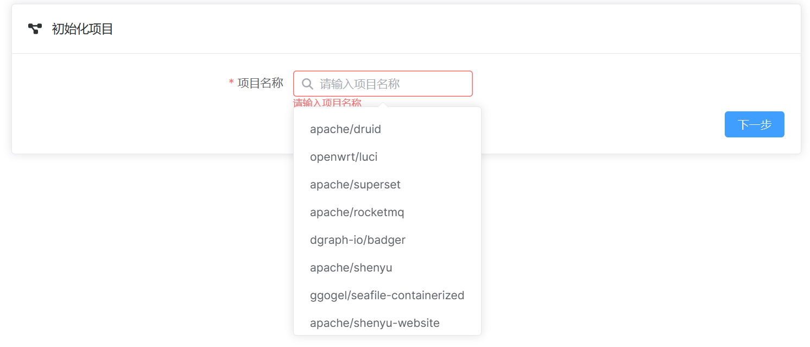
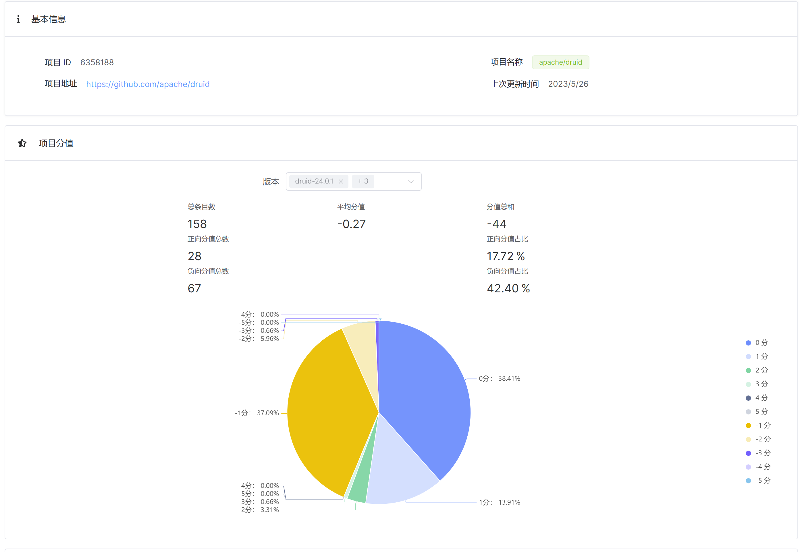
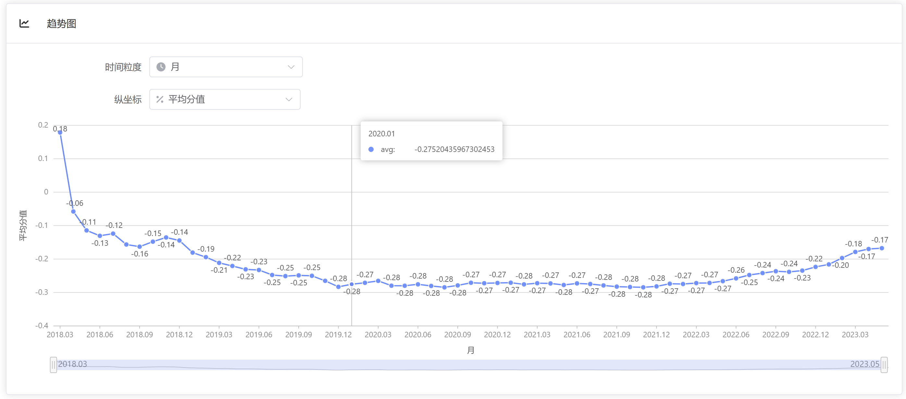

# SentiStrength 前端文档

| 变更人 | 变更日期   | 变更内容   |
| ------ | ---------- | ---------- |
| 邓尤亮 | 2023/06/01 | 文档初始化 |

[toc]

## 1. 项目简介

在线访问：http://124.223.97.89/

该项目采用了 Vue3 + Vite 技术，集成了 Vue-Router, Element-Plus, Font Awesome 等模块。

迭代二的相关内容请参考：[/迭代二/项目文档/前端文档.md]

## 2. 具体设计

前端界面由左侧的导航栏和右侧的内容部分组成。

除了文本分析以外，还包括两部分：

1. 项目分析：分析项目 Issue 情感值
2. 标注展示：展示情绪方面的标注结果

### 2.1 项目分析

该部分首先需要指定某个具体项目。提示框中是已爬取过数据的项目。用户也可以手动输入项目的完整名称（例：`apache/rocketmq`）后点击下一步开始初始化项目。该操作所需的时间通常较长，用户可以等待一段时间后再看。

选择好项目之后进入下一个界面。

首先，基本信息一栏展示了该项目的基本信息。下面是项目分值部分。在多选框中选择版本之后便可以看到一些统计数据以及一个饼图。统计数据展示了选择的版本信息中情感文本的条目、正向和负向分值总数和占比等数据。饼图则展示了从选择的第一个版本到最后一个版本区间中各情感分值的占比和数量。

下面的趋势图部分，用户可以选择时间粒度和展示的分值类型，观察项目随时间变化的分值波动

最后，在项目 Issue 部分，用户可以选择对 Issue 进行排序以及选择 Issue 的状态。在下方的表格中展示了某一 Issue 的基本信息，可以点击链接跳转至 Github 查看。展开详细信息可以进一步查看该 Issue 的其他内容，比如主体部分。

## 2.2 标注展示

该部分有两个图，分别为热力图和折线图。展示 `apache/rocketmq` 两个版本中已标注的评论的相关数据。
