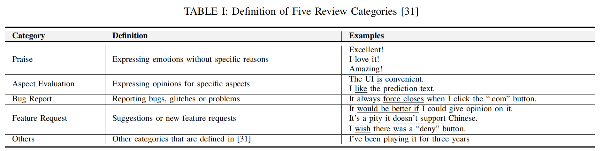
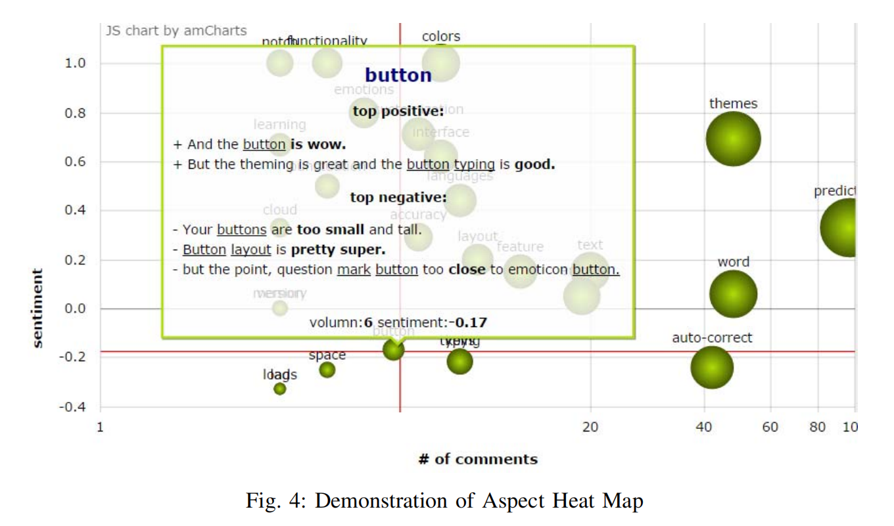

# notes of What parts of your apps are loved by users?

201250067 徐浩钦

## Abstract

核心思想：

评论不仅仅是单词的集合，需要依据方面分析。

Instead of a _bags-of-words assumption_, it classififies reviews into **five categories** and extracts aspects in sentences which include evaluation of aspect using a **pattern-based parser**.

## INTRODUCTION

- 研究目的：

  - 通过分析软件评论，了解用户反馈。
  - 解决现有工具的不足：只使用 bag-of-word assumption，将各个方面、主题混合，不能衡量每个方面的情绪。

- 研究难点：

  - 用户评论数量多，无法手动检查。
  - 用户评论种类多，需要区分。

- 解决方法：
  - make full use of the **monotonous structure** and **semantics** of software user reviews, and directly **parses aspect opinion pairs** from review sentences based on pre-defined sentence patterns
  - **SUR-Miner**
- contributions
  - a classifification technique，根据文本特性分为五个方面
  - a pattern-based parsing technique，解析评论，提取方面
  - novel interactive visualizations
  - an empirical evaluation

## RELATED WORK

- APP Review Filtering
- Aspect Extraction from App Reviews
- Review Mining in Other Marketplaces

## SUR-MINER

six steps:

1. split reviews into sentences
2. classify each sentence into five categories: _aspect evaluation_, _praises_, _feature requests_, _bug reports_ and _others_
3. only select sentences in the _aspect evaluation_ category and fifilter out other types of sentences
4. extract aspects and corresponding opinions and sentiments from the set of “aspect evaluation” sentences
5. resulting aspect-opinion-sentiment pairs are clustered and visualized with two interactive diagrams

### Step 1 - Preprocessing

问题：

- 一条评论可能包含不同方面，需要分别分析
- 评论可能包含拼写错误，难自动识别

解决方法：

- 将评论拆分为单句
- 常见错误拼写修正

### Step 2 - Review Classification

问题：

- 手动分类，进行方面评估不现实

解决方法：

- 实现评论的自动分类，选择包含方面的句子

### Step 3 - Aspect-Opinion Extraction

问题：

- 需要总结用户对各个方面的看法

解决方法：

- SUR-Miner extracts aspect-opinion pairs (i.e., aspect and opinion words) from each review sentence classified in the _aspect evaluation_ category

### Step 4 - Aspect Sentiment Analysis

We apply sentiment analysis for each review sentence and associate the sentiments to the corresponding aspects with user ratings and a sentiment analysis tool.

### Step 5 - Aspect Clustering and Summarization

We group aspect-opinion pairs with the same aspects and summarize sentiments and typical opinions for each aspect group

### Step 6 - Visualization

- The **Aspect Heat Map** demonstrates popular aspects that users are concerned with.

  

- The **Aspect Trend Map** demonstrates the sentiment trends over time.

之后的准确性验证部分与步骤三任务关系不大。

## EMPIRICAL EVALUATION

## THREATS TO VALIDITY

**Ground truth labels were judged by two people.**

## CONCLUSION
