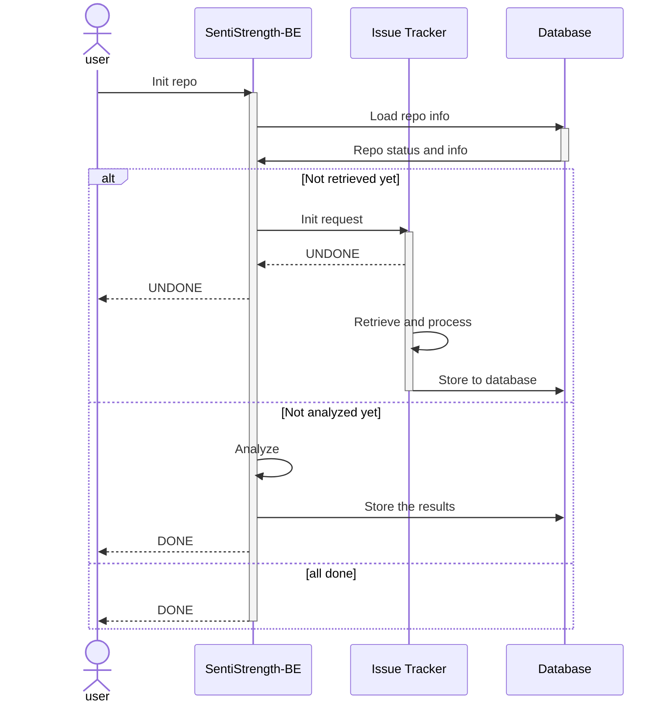

# 设计考虑与 Step 3 展示

| 变更人 | 变更日期   | 变更内容   |
| ------ | ---------- | ---------- |
| 谭子悦 | 2023/06/02 | 文档初始化 |

## 整体设计

在数据获取、处理、分析、可视化展示上，我们的系统实现了完全的自动化，其中依靠的除原有的 SentiStrength 后端外还有一个独立的数据获取服务 Issue Tracker.

### 基本流程

从初始化 Repo 到展示数据需要经过以下步骤：

1. 前端请求后端服务进行初始化操作；
2. 后端服务向 Issue Tracker 提交 Repo 获取任务，并返回“未完成”给前端；
3. IssueTracker 异步执行数据获取工作，与此同时前端通过后端服务轮询（如有需要）任务进度；
4. IssueTracker 工作完成后，前端再次请求后端，后端服务发现数据库表更新，开始对该 Repo 所有的 Issues 进行情绪分析，分析完毕后写入数据库中，最后返回 DONE 给前端；
5. 此时数据初始化完成，后端可返回各类数据给前端。

其中初始化的详细流畅如下所示，还可以参考 [接口文档.md](接口文档.md).

⬆️ _Repo 初始化交互流程图_

### Issue Tracker

我们的 Issue Tracker 服务选用了 Golang 进行开发，主要考虑到 Goroutine ·

## 数据处理考量

### 数据选择

@tzy

### 数据分析

@xhq @hgs

## 分析结果展示

@xhq @hgs
