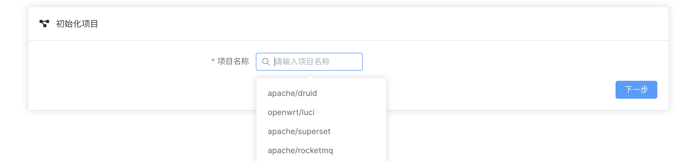
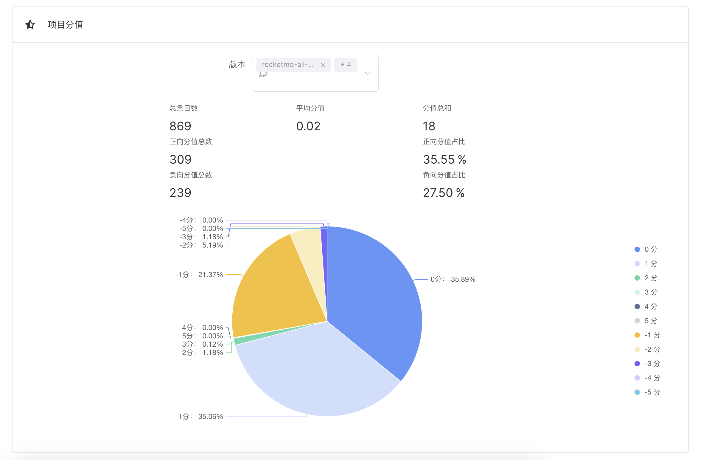
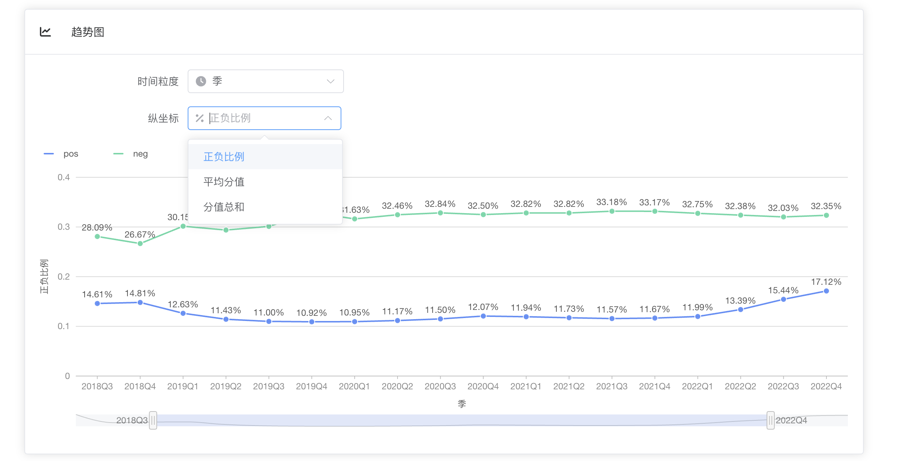
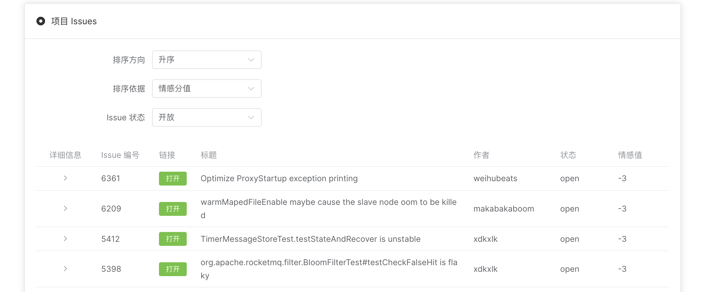
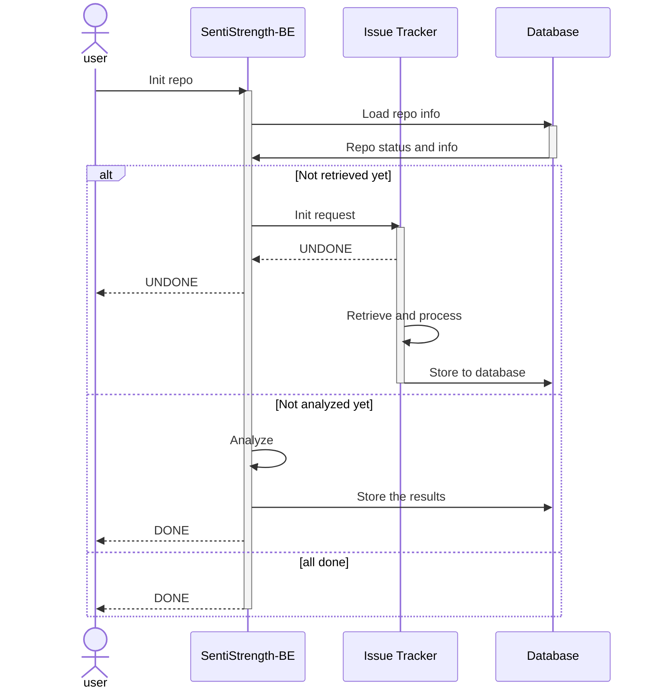
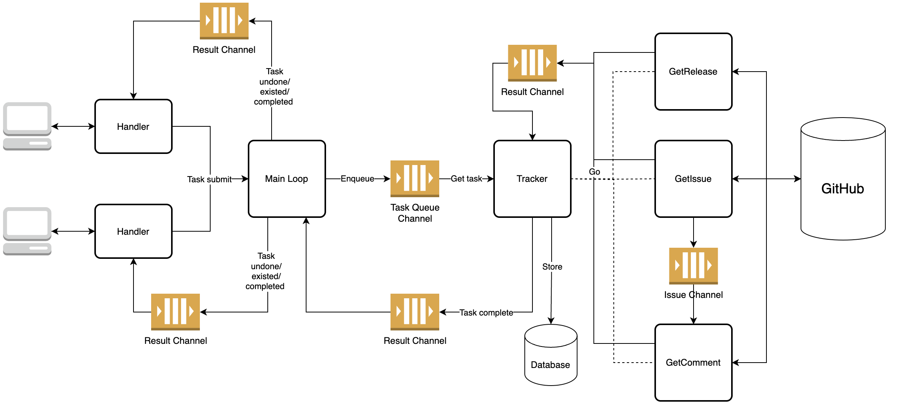

# 设计考虑与 Step 3 展示

| 变更人 | 变更日期   | 变更内容   |
| ------ | ---------- | ---------- |
| 谭子悦 | 2023/06/02 | 文档初始化 |

## 一、整体设计

在数据获取、处理、分析、可视化展示上，我们的系统实现了完全的自动化，其中依靠的除原有的 SentiStrength 后端外，还有一个独立的数据获取服务：_Issue Tracker_.

### 基本功能

详见 [前端设计文档.md](其他文件/前端设计文档.md)

我们的系统支持以下功能：

- 自由添加 Repo 进行分析

  

  > Note: 不支持关闭了 Issue 功能的 Repo，如 Apache/Flink

- 自动分析 Repo Issues 的情绪分值
- 选择 Releases 展示一个 Repo 的总体情绪情况、各情绪分值占比

  

- 以月、季度、年、Release 为单位，展示该 Repo 的历史情绪分值正负比例、平均分值、分值总和变化趋势图

  

- 按照情绪分值、Issue 状态等排序筛选查看 Repo 的历史 Issues

  

### 初始化流程

从初始化 Repo 到展示数据需要经过以下步骤：

1. 前端请求后端服务进行初始化操作；
2. 后端服务向 Issue Tracker 提交 Repo 获取任务，并返回“未完成”给前端；
3. IssueTracker 异步执行数据获取工作，与此同时前端通过后端服务轮询（如有需要）任务进度；
4. IssueTracker 工作完成后，前端再次请求后端，后端服务发现数据库表更新，开始对该 Repo 所有的 Issues 进行情绪分析，分析完毕后写入数据库中，最后返回 DONE 给前端；
5. 此时数据初始化完成，后端可返回各类数据给前端。

其中初始化的详细流程如下所示，还可以参考 [接口文档.md](其他文件/接口文档.md)

⬆️ _Repo 初始化交互流程图_

### [Issue Tracker](https://github.com/SentiSamoyed/IssueTracker)

出于开发效率和性能上的考虑，我们的 Issue Tracker 服务选用了 Golang 进行开发，用 [Google 开发的 GitHub API Lib](https://github.com/google/go-github) 获取数据，用 [GORM](https://gorm.io/) 写入数据库中，并用 Go 原生的 `net/http` 做简单服务器监听。

由于服务器性能较弱（2 核 4G）且 GitHub API 有访问频率限制（鉴权后每小时 5000 条），Issue Tracker 设计为了单线程任务队列，即只能同时处理一个 Repo 的获取请求；且会记住各 Repo 的执行记录，避免重复执行。

⬆️ _基本过程示意图，其中大量使用了 Goroutine，并用 channel 传递信息_

## 二、数据处理考量

### 数据选择

#### Issues & PRs

在 GitHub API 中，“获取 Issue” 接口取回的数据是包含 Pull Requests 的，这也就意味着 PR 也是可以纳入 Issue 分析的考虑范围的。但经过考量后我们最终还是决定排除其中的 PR，因为 PR 中的文字内容大多为对工作与任务的中性客观描述，不太具有参考价值。

#### Release

如何确定 “Issue 对应的 Release” 是我们在开发中遇到的一个难题，虽然 GitHub Issue 中有 “milestone” 用于确定版本，但实际是大部分 Issues 都没有设置它，所以并无法用于判断。最后我们只能按照助教所说的“从一个 Release 发布到下一个 Release 发布前”来划定一个 Release 的 Issue 区间，虽然这么做显然是有问题的，比如 Apache/RocketMQ 就会交叉发布 4.x.x 和 5.x.x 的 Release.

#### Comments

在数据获取中，我们同时存储了每个 Issue 下的所有 Comments 到数据库中，但 Comments 和 Issue 正文相对独立，不适合一起算分，也不适合和 Issue 并列算分，所以我们在自动化分析中并未对其进行分析并纳入 Repo/Issue 分析结果。

### 数据分析

@xhq @hgs

## 三、分析结果展示

@xhq @hgs
