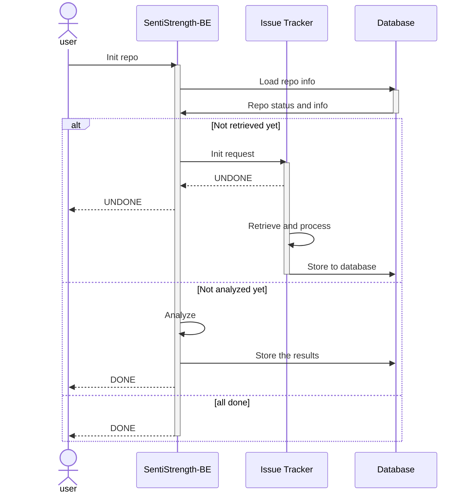
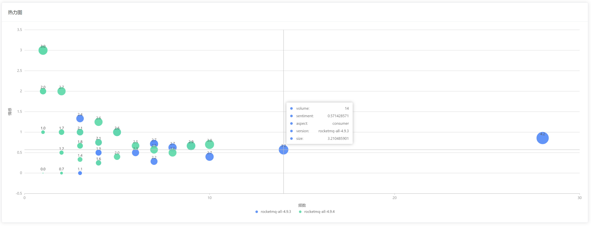

# 设计考虑与 Step 3 展示

| 变更人               | 变更日期   | 变更内容        |
| -------------------- | ---------- | --------------- |
| 谭子悦               | 2023/06/02 | 文档初始化      |
| 徐浩钦、华广松、陈骏 | 2023/06/02 | 完成 step3 报告 |

## 一、整体设计

在数据获取、处理、分析、可视化展示上，我们的系统实现了完全的自动化，其中依靠的除原有的 SentiStrength 后端外，还有一个独立的数据获取服务：_Issue Tracker_.

### 基本功能

详见 [前端设计文档.md](其他文件/前端设计文档.md)

我们的系统支持以下功能：

- 自由添加 Repo 进行分析

  

  > Note: 不支持关闭了 Issue 功能的 Repo，如 Apache/Flink

- 自动分析 Repo Issues 的情绪分值
- 选择 Releases 展示一个 Repo 的总体情绪情况、各情绪分值占比

  

- 以月、季度、年、Release 为单位，展示该 Repo 的历史情绪分值正负比例、平均分值、分值总和变化趋势图

  

- 按照情绪分值、Issue 状态等排序筛选查看 Repo 的历史 Issues

  

### 初始化流程

从初始化 Repo 到展示数据需要经过以下步骤：

1. 前端请求后端服务进行初始化操作；
2. 后端服务向 Issue Tracker 提交 Repo 获取任务，并返回“未完成”给前端；
3. IssueTracker 异步执行数据获取工作，与此同时前端通过后端服务轮询（如有需要）任务进度；
4. IssueTracker 工作完成后，前端再次请求后端，后端服务发现数据库表更新，开始对该 Repo 所有的 Issues 进行情绪分析，分析完毕后写入数据库中，最后返回 DONE 给前端；
5. 此时数据初始化完成，后端可返回各类数据给前端。

其中初始化的详细流程如下所示，还可以参考 [接口文档.md](其他文件/接口文档.md)

⬆️ _Repo 初始化交互流程图_

### [Issue Tracker](https://github.com/SentiSamoyed/IssueTracker)

出于开发效率和性能上的考虑，我们的 Issue Tracker 服务选用了 Golang 进行开发，用 [Google 开发的 GitHub API Lib](https://github.com/google/go-github) 获取数据，用 [GORM](https://gorm.io/) 写入数据库中，并用 Go 原生的 `net/http` 做简单服务器监听。

由于服务器性能较弱（2 核 4G）且 GitHub API 有访问频率限制（鉴权后每小时 5000 条），Issue Tracker 设计为了单线程任务队列，即只能同时处理一个 Repo 的获取请求；且会记住各 Repo 的执行记录，避免重复执行。

⬆️ _基本过程示意图，其中大量使用了 Goroutine，并用 channel 传递信息_

## 二、数据处理考量

### 数据选择

#### Issues & PRs

在 GitHub API 中，“获取 Issue” 接口取回的数据是包含 Pull Requests 的，这也就意味着 PR 也是可以纳入 Issue 分析的考虑范围的。但经过考量后我们最终还是决定排除其中的 PR，因为 PR 中的文字内容大多为对工作与任务的中性客观描述，不太具有参考价值。

#### Release

如何确定 “Issue 对应的 Release” 是我们在开发中遇到的一个难题，虽然 GitHub Issue 中有 “milestone” 用于确定版本，但实际是大部分 Issues 都没有设置它，所以并无法用于判断。最后我们只能按照助教所说的“从一个 Release 发布到下一个 Release 发布前”来划定一个 Release 的 Issue 区间，虽然这么做显然是有问题的，比如 Apache/RocketMQ 就会交叉发布 4.x.x 和 5.x.x 的 Release.

#### Comments

在数据获取中，我们同时存储了每个 Issue 下的所有 Comments 到数据库中，但 Comments 和 Issue 正文相对独立，不适合一起算分，也不适合和 Issue 并列算分，所以我们在自动化分析中并未对其进行分析并纳入 Repo/Issue 分析结果。

### 数据分析

在数据选择中，我们希望通过选择合适的数据，研究同一个项目中两个不同的版本在开发中的评论，展现出两个版本在开发过程中的比较和关联。

具体需要标注数据的选择，主要影响因素有仅凭时间不一定能确定版本（同一时间内可能有多个版本正在开发），和手工标注在数量上的局限性。因此，我们选择了两个在其开发过程中，没有其他版本正在开发的版本。并且均选择了版本开发之初的评论数据进行分析。最终，我们选择了 apache/rocketmq 项目中 rocketmq-all-4.9.3 和 rocketmq-all-4.9.4 两个版本中的时间跨度从开始到开始后一个半月的评论数据进行标注。

在数据分析中，我们分别选择了 apache/rocketmq 项目 4.9.3 和 4.9.4 两个版本的数据，每个版本挑选了 400 条内容丰富的 comment，在去掉中文数据、无效语句后总共标注了 291 条数据。对于标注好的 291 条数据，我们从两个维度分别进行分析。

一方面，我们使用热图的形式分析版本内的数据。对标注数据进行粗略估计后，我们将 aspect 的词频作为热图的自变量，将 aspect 的情绪值作为因变量。在确定 aspect 的情绪值时，考虑到强烈的正面情绪和负面情绪都能反映出 aspect 的重要性，所以我们将包含 aspect 的数据的情绪得分取绝对值后求平均值作为 aspect 的情绪得分。热图中球体的大小我们采用公式 `size = lg(frequency) + sentiment`求得，不同颜色的小球代表不同版本的 aspect，通过不同版本小球的比较也可以粗略分析不同版本的分布。

另一方面，我们使用折线图的形式分析两个版本间的数据关系。折线图中，我们将项目开始后的时间作为自变量，当日 comment 数量作为因变量，同时展示在当天 comment 中出现频率最高的 aspect。

## 三、分析结果展示

1. 情绪趋势：由热图中的球体分布，我们可以知道高词频的情绪值较高，而低频词的情绪值较低，可以推断在该数据集中，高词频比低词频的讨论往往更激烈。
2. 高频词分析：在热图的高频词中，`broker`、`consumer`、`topic`等词更与积极情绪相关，这些词是具有普遍关注度或重要性的词汇，在 apache/rocketmq 项目情绪表达中起到重要作用。RocketMQ 是一款开源的分布式消息队列系统，consumer 是消息队列中的消息接收方，它从 broker 订阅或消费消息，并对消息进行处理，broker 是消息队列的中间层，负责存储和转发消息。由此可见，consumer 和 broker 是 RocketMQ 的重要组件，被开发者广泛而热烈地讨论。
3. 低频词分析：低频词中，`storetime`、`block`等词的情绪更强烈，说明这些 aspect 更可能与积极或消极情绪相关，它们是一些特定领域或语境下出现的词汇，通过热图分析我们发现了这些在情绪表达中较为罕见但有一定情绪色彩的词汇。在 RocketMQ 中，`storetime`是指消息在 broker 中存储的时间戳，它表示消息被持久化到存储系统的时间。每条消息在被存储时都会附带一个存储时间，用于记录消息的持久化时间点。从热图可以看出，RocketMQ 中与时间戳有关的问题多为负面。
4. 低频高情绪值分析：低频词中，情绪最为强烈的评论为一条开发者对 issue 提出者的回复，对其提出的 bug 的工作给予肯定，同时指出将采用新的 Client 来解决问题，这种项目管理者与其他社区人员的友好氛围体现了开源的优越性。

1. 评论数量趋势：
   1. 两个版本的评论在项目最初都较少，从第四天开始，评论数量增加。
   2. 相比 rocketmq-all-4.9.4 版本，rocketmq-all-4.9.3 版本在开发过程中评论数量波动的比较小。值得注意的是，rocketmq-all-4.9.4 版本在第 11 天附近评论数量激增，讨论较多。可能是该版本出现了比较严重的问题，或者推出了具有争议性的新特性。
   3. 总体来看，两个版本的评论数量随时间呈现小幅度波动状态，每天的评论数量基本在 10 条以内。
2. 假设和解释：
   1. 基于以上对折线图的观察和分析，comment 之所以呈现这种趋势，可能是由于在新版本刚开始的时候，出于对项目的不熟悉，以及进展较慢，对项目的讨论热度不高。很快随着项目的深入开展，逐渐形成了稳定的讨论状态。
   2. 在 comment 到达峰值之后，之后几天的数值往往会低于峰值之前的平均值，可能是由于峰值讨论的问题或特性需要时间进行理解或检验。
   3. comment 达到峰值时，aspect 为 synchronized 这一 Java 关键字，这跟 RocketMQ 为一款低延迟，高并发，高可用的分布式中间件这一项目特性有明显关系，其同步能力的强弱决定了产品的好坏。
