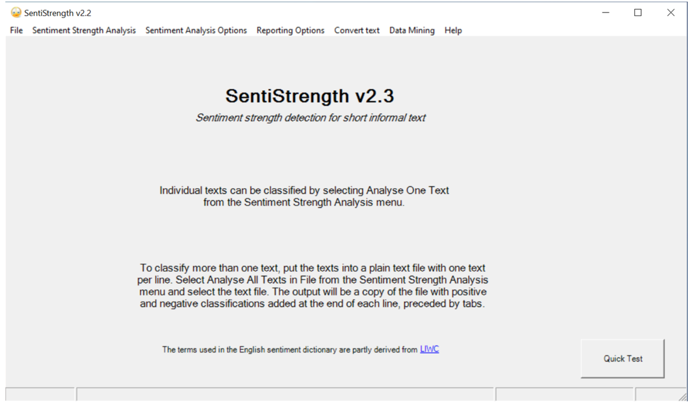

# 迭代二第二次会议

| 时间     | 2023.03.28              |
| -------- | ----------------------- |
| 主题     | 迭代二问题讨论+进度同步 |
| 参与人员 | 全体                    |
| 形式     | 飞书会议                |

[TOC]

> 🧐 **总览**
> 1. 确认了前端的具体功能。
> 2. 进行了进度同步。
> 3. 针对中期检查结果与项目现状，增加了测试相关任务。

## 前端功能确认

主要包含三大功能：

- 文件导入
  - 输入文本
  - 配置文本（语料库？LookupTable？）
- 配置项选择
- 执行

前端框架采用 vue 构建。

## 进度同步

### 代码质量维护

- 目前已经开始使用 checkstyle，正在配合人工检查代码，预计 3.29 完成第一次修改。
- 关键 bug 尚未找出，需要加快进度。

### 代码设计优化

- 代码重构尚未开始
- 前端初步着手，后端框架尚未构建

#### 后端构建方案

不破坏原有的 `uk.ac.wlv` 结构，在此包外创建新包，用 Spring Boot 构建后端封装层。

## 测试

经昨天中期检查结果和开会讨论后，决定追加测试任务，其中测试氛围两部分：

1. **SentiStrength 系统功能测试**

   关于 SentiStrength 系统本身的测试，与“找出系统功能 bug ”任务密切相关。

   由 @谭子悦 于 03.28 完成框架搭建、规范编写；@徐浩钦、@杜威、@陈骏 编写相关测试用例。

2. **后端框架测试**

   后端封装层的正确性设计，由 @谭子悦 负责。