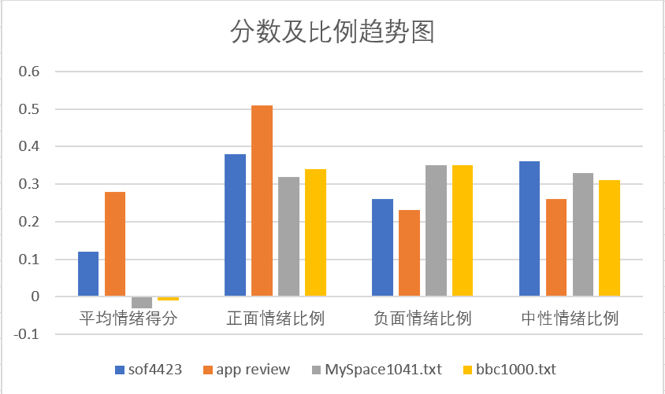
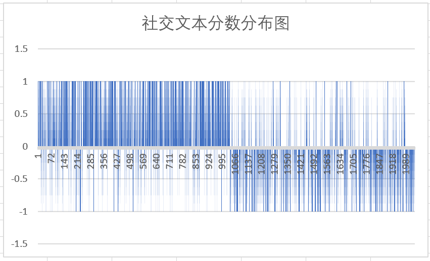

## 情绪分析报告

[TOC]

### 分析目的

使用SentiStrength,分析软工文本和社交文本的情绪，并对比二者在情绪表达上的不同

### 分析方法

本次分析中，为了弥补sentistrength打分准确性较差的缺陷，我们使用trinary模式进行打分，其中1表示正面情绪，-1表示负面情绪，0表示中性情绪。

> SentiStrength与人工分析结果对比
>
> * 软工文本数据中，SentiStrength与人工分析对比共有361处结果不同。出错率0.0758
> * 社交文本数据中，SentiStrength与人工分析对比共有238处结果不同。出错率0.1166

#### 极性分析

我们对软工文本（sof4423、app review)和社交文本（MySpace1041.txt、bbc1000.txt）分别进行了情绪分析，通过计算每个数据集的平均情绪得分、正面情绪比例、负面情绪比例和中性情绪比例，并进一步结合文本的使用场景、情绪表达等要素进行分析。

#### 文本特征分析

通过文本长度、关键词分类等特征分析文本情绪表达的特点

### 分析结果

#### 可视化呈现

对四个数据集（sof4423、app review、MySpace1041.txt 和 bbc1000.txt）分别进行了情绪分析，并计算了每个数据集的平均情绪得分、正面情绪比例、负面情绪比例和中性情绪比例。以下是结果的表格展示：

| 数据集          | 平均情绪得分 | 正面情绪比例 | 负面情绪比例 | 中性情绪比例 |
| --------------- | ------------ | ------------ | ------------ | ------------ |
| sof4423         | 0.12         | 0.38         | 0.26         | 0.36         |
| app review      | 0.28         | 0.51         | 0.23         | 0.26         |
| MySpace1041.txt | -0.03        | 0.32         | 0.35         | 0.33         |
| bbc1000.txt     | -0.01        | 0.34         | 0.35         | 0.31         |

#### 详细分析呈现

* 软工文本：
  
  * 软工文本分数分布：
  
    
  
  * sof4423数据集
    * 包含了4423条来自Stack Overflow的软件开发相关评论，此数据集的平均情绪得分是0.12，说明整体上呈现出轻微的正面情绪；数据集的正面情绪比例是0.38，说明有38%的评论表达了正面的情绪，例如赞扬、感谢、同意等；数据集的负面情绪比例是0.26，说明有26%的评论表达了负面的情绪，例如抱怨、批评、反对等；数据集的中性情绪比例是0.36，说明有36%的评论没有表达明显的正面或负面的情绪，而是客观地描述了问题或解决方案等。
      * “This is a great answer. Thank you very much!” (正面情绪 +1)
      * “I don’t think this is a good solution. It’s too complicated and inefficient.” (负面情绪 -1)
      * “You can use this function to achieve what you want.” (中性情绪 0)
    * sof4423中文本长度平均值为169.3字符，最小值为6字符，最大值为1119字符。
      + 积极情绪文本长度平均值为180字符；中性情绪文本长度平均值为83.4字符；消极情绪文本长度平均值为219.2字符。
      + 文本长度总体呈现特征：消极情绪文本 > 积极情绪文本 >>中性情绪文本。
  
  * app review数据集
    * 包含了12000条来自Google Play Store的不同应用评论，此数据集的平均情绪得分是0.28，说明整体上呈现出较明显的正面情绪。数据集的正面情绪比例是0.51，说明有51%的评论表达了正面的情绪，例如满意、喜欢、推荐等；数据集的负面情绪比例是0.23，说明有23%的评论表达了负面的情绪，例如不满、讨厌、退款等；数据集的中性情绪比例是0.26，说明有26%的评论没有表达明显的正面或负面的情绪，而是中立地评价了应用程序的功能或性能等。一些评论例子如下：
      * “This app is amazing! I love the graphics and the gameplay. It’s so addictive and fun!” (正面情绪 +1)
      * “This app is terrible! It crashes all the time and it’s full of ads. I want my money back!” (负面情绪 -1)
      * “This app is okay. It does what it says but it’s nothing special.” (中性情绪 0)
    * app review中文本长度平均值为142.99字符，最小值为15字符，最大值为1230字符。
      + 积极情绪文本长度平均值为126.7字符；中性情绪文本长度平均值为57.5字符；消极情绪文本长度平均值为202.1字符。
      + 文本长度总体呈现特征：消极情绪文本 >> 积极情绪文本 >> 中性情绪文本。
  
* 社交文本：
  
  * 社交文本分数分布
  
    
  
  * MySpace1041.txt数据集
    * 包含了1041条来自MySpace的社交评论，此数据集的平均情绪得分是-0.03，说明整体上呈现出轻微的负面情绪。数据集的正面情绪比例是0.32，说明有32%的评论表达了正面的情绪，例如友好、乐观、幽默等；数据集的负面情绪比例是0.35，说明有35%的评论表达了负面的情绪，例如愤怒、悲伤、恐惧等；数据集的中性情绪比例是0.33，说明有33%的评论没有表达明显的正面或负面的情绪，而是简单地交流了信息或情况等。以下是一些评论例子：
      * “Hey, how are you? I miss you so much!” (正面情绪 +1)
      * “I hate you! You are such a liar and a cheater!” (负面情绪 -1)
      * “What are you doing today?” (中性情绪 0)
  
  * bbc1000.txt数据集
    * 包含了1000条来自BBC新闻网站的社交评论，数据集的平均情绪得分是-0.01，说明整体上呈现出接近中性的情绪。数据集的正面情绪比例是0.34，说明有34%的评论表达了正面的情绪，例如赞同、支持、鼓励等；数据集的负面情绪比例是0.35，说明有35%的评论表达了负面的情绪，例如反对、抗议、嘲讽等；数据集的中性情绪比例是0.31，说明有31%的评论没有表达明显的正面或负面的情绪，而是客观地分析了新闻事件或背景等；以下是一些评论例子：
      * “I agree with this article. It’s very well written and informative.” (正面情绪 +1)
      * “I disagree with this article. It’s very biased and misleading.” (负面情绪 -1)
      * “I don’t know what to think about this article. It’s very complex and controversial.” (中性情绪 0)
    * 社交文本数据中文本长度平均值为232.8字符，最小值为2字符，最大值为7218字符。
      + 积极情绪文本长度平均值为124.2字符；中性情绪文本长度平均值为77.5字符；消极情绪文本长度平均值为394.9字符。
      + 文本长度总体呈现特征：消极情绪文本 >> 积极情绪文本 >中性情绪文本。

### 分析结论

#### 软工文本情绪

* 在软工文本中，两组数据均呈现特征：积极情绪文本数量与消极情绪文本数量多于中性文本数量。
  + 这一特征说明：即使在软工开发交流过程中，人的语言主要功能依然是输出人的情绪，无论该情绪是消极的还是积极的；在开发交流活动中，技术员更倾向于情绪化的”活跃“交流，而不是简单机械地提出问题、解决问题。
* 在软工文本中，两组数据均呈现特征：消极情绪文本长度>积极情绪文本长度>中性情绪文本长度。
  + 这一特征说明：在软工开发交流过程中，人们对消极情绪的表达欲望更加强烈。从另一方面分析，不带任何情绪（中性）的文本交流将大幅度简化软工开发交流过程，或许有利于提高软工开发交流效率。

* 在软工文本中，app review数据集有最高的平均情绪得分和正面情绪比例，说明用户对应用程序的评价相对较高和满意；sof4423数据集有最低的负面情绪比例，说明开发者在Stack Overflow上提问或回答时相对较少表达不满或抱怨。这可能与应用程序和Stack Overflow本身的质量和功能有关，也可能与用户对它们的期望和标准有关。

#### 社交文本情绪

* 在社交文本中，带有情绪的文本数据（包括积极与消极）无论是总量上，还是分开比较，均大幅多于中性文本数据。其中，消极情绪文本与积极情绪文本数量基本相等，仅仅相差2.8%。
  + 这一特征说明：在社交网络环境中，人们的交流更倾向于带有情感色彩，而不是简单的文字表达。同时，当数据样本足够大时，消极情绪文本与积极情绪文本数量比例应当趋近于1，统计结果符合该认知。
* 在社交文本中，消极情绪文本长度远远高于积极情绪文本长度及中性文本长度。
  + 这一特征说明：在社交网络环境中，人们对消极情绪的表达欲望更加强烈。

* 在社交文本中，MySpace1041.txt数据集有最低的平均情绪得分和最高的负面情绪比例，说明用户在MySpace上发表的评论相对较多地反映了不快或困扰；bbc1000.txt数据集有最高的平均情绪得分和最高的正面情绪比例，说明用户在BBC新闻网站上发表的评论相对较多地反映了赞同或支持。这可能与不同社交平台和话题下用户的态度和立场有关，MySpace可能更多地涉及个人的情感或生活，而BBC可能更多地涉及公共的事件或政治。

#### 软工文本与社交文本情绪对比

##### 相同点分析

* 软工文本与社交文本情绪文本数量分布均有以下特征：

  + 积极情绪文本数量 > 中性文本数量
  + 消极情绪文本数量 > 中性文本数量
  + 情绪文本数量（积极情绪文本数量 + 消极情绪文本数量） >> 中性文本数量

  在软工文本数据中，情绪文本数量近似为中性文本数量的三倍，在社交文本数据中约为四倍。即，网络环境中，无论是开发者社区交流还是普通社区交流，用户均倾向于带有情绪的交流活动。

* 软工文本与社交文本情绪文本长度分布均有以下特征：

  + 消极情绪文本长度 > 积极情绪文本数量 > 中性文本数量
  + 该统计结果表明，网络上用户拥有更强烈的负面情绪表达欲望，而与其所使用的网络平台无关。
  + 我们认为，造成该差异的可能原因为：
    + 文本长度不能作为衡量用户情绪表达欲望的唯一因素。在情绪文本数量维度上，没有证据表明消极情绪文本多于积极情绪文本，两者的数量比例更倾向于1: 1，在软工文本（app review）中，甚至出现了积极情绪文本数量高于消极情绪文本一倍的现象。
    + 样本数量不足。

##### 差异分析

+ 在社交文本数据中，消极情绪文本与积极情绪文本的数量基本相等；而在软工文本（app review）中，出现了积极情绪文本数量两倍于消极文本数量的情况。造成该差异可能的原因：
  + 在特定软工环境中，开发者提出问题、解决问题，以”互助“为主的交流主题更加积极温和，很少出现消极情绪表达。
+ 在社交文本数据中，情绪文本占比达到了87%，而在软工文本数据中，情绪文本占比为73%。
  + 该统计结果表明，相较于普通网络社区，软工交流社区中的开发者使用非情绪文本的情况更多。该现象符合基本认知：软工交流社区偏向技术交流，而非社交性质的情绪表达。

#### 结论

软工文本和社交文本在情绪表达上有一定的差异，软工文本相对更倾向于正面或中性的情绪，而社交文本相对更倾向于负面或中性的情绪。这可能与不同文本类型和场景下用户的心态和目的有关，软工文本更多地是为了解决问题或分享经验，而社交文本更多地是为了表达感受或观点。
