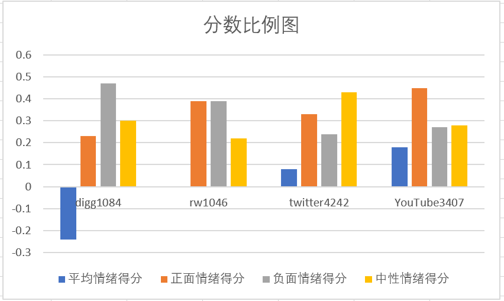
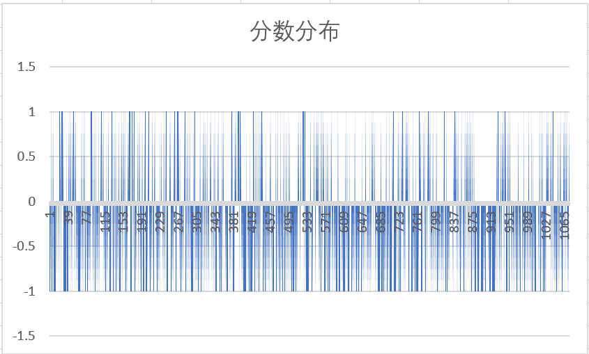
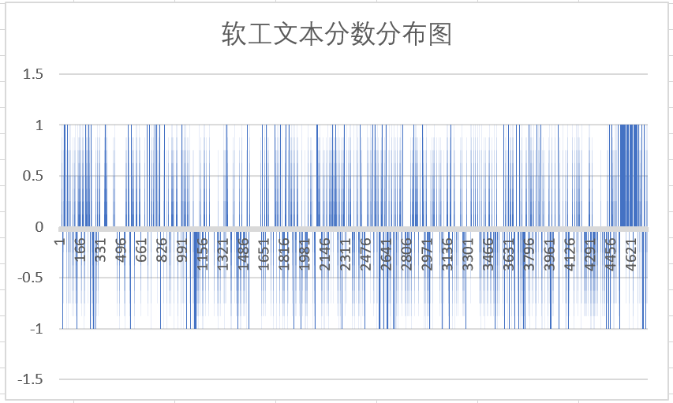
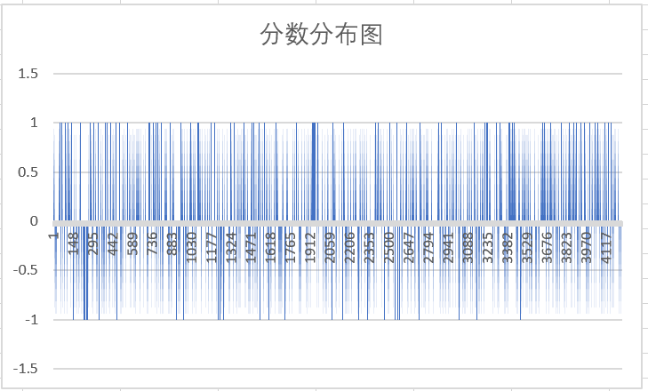
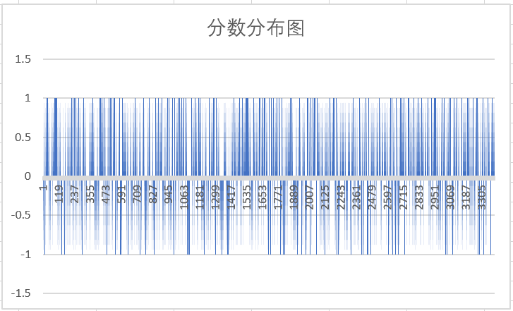

## 情绪分析报告

| 变更人 | 变更日期   | 变更内容 |
| ------ | ---------- | -------- |
| 华广松 | 2023/04/19 | 文档完成 |

[TOC]

### 数据来源

本次分析的数据全部来源于 SentiStrength 官方提供的数据集，分别为`digg1084`、`rw1046`、`twitter4242`、`YouTube3407`

### 分析方法

本次分析中，为了弥补 sentistrength 打分准确性较差的缺陷，我们使用 trinary 模式进行打分，其中 1 表示正面情绪，-1 表示负面情绪，0 表示中性情绪。

#### 极性分析

我们对`digg1084`、`rw1046`、`twitter4242`、`YouTube3407`分别进行了情绪分析，通过计算每个数据集的平均情绪得分、正面情绪比例、负面情绪比例和中性情绪比例，并进一步结合文本的使用场景、情绪表达等要素进行分析。

### 分析结果

#### 可视化

对四个数据集（`digg1084`、`rw1046`、`twitter4242`、`YouTube3407`）分别进行了情绪分析，并计算了每个数据集的平均情绪得分、正面情绪比例、负面情绪比例和中性情绪比例。以下是结果的表格展示：

| 数据集      | 平均情绪得分 | 正面情绪比例 | 负面情绪比例 | 中性情绪比例 |
| ----------- | ------------ | ------------ | ------------ | ------------ |
| digg1084    | -0.24        | 0.23         | 0.47         | 0.30         |
| rw1046      | 0.00         | 0.39         | 0.39         | 0.22         |
| twitter4242 | 0.08         | 0.33         | 0.24         | 0.43         |
| YouTube3407 | 0.18         | 0.45         | 0.27         | 0.28         |

#### 详细分析

- digg1084:

  - 分数分布：

    

  - 分析：

    此数据集包含了 1084 条评论，数据集的平均情绪得分是-0.24，说明整体上呈现较明显的负面情绪。数据集的正面情绪比例是 0.23，说明有 23%的评论表达了正面的情绪，例如友好、乐观、幽默等；数据集的负面情绪比例是 0.47，说明有 47%的评论表达了负面的情绪，例如愤怒、悲伤、恐惧等；数据集的中性情绪比例是 0.30，说明有 30%的评论没有表达明显的正面或负面的情绪，而是简单地交流了信息或情况等。

- rw1046：

  - 分布：

  

  - 分析：

    此数据集包含了 1046 条评论，数据集的平均情绪得分是 0，说明整体上呈现出接近中性的情绪。数据集的正面情绪比例是 0.39，说明有 39%的评论表达了正面的情绪，例如赞同、支持、鼓励等；数据集的负面情绪比例是 0.39，说明有 39%的评论表达了负面的情绪，例如反对、抗议、嘲讽等；数据集的中性情绪比例是 0.22，说明有 22%的评论没有表达明显的正面或负面的情绪

- twitter4242：

  - 分布：

    

  - 分析：

    此数据集包含了 4242 条评论，数据集的平均情绪得分是 0.08，说明整体上呈现出轻微的正面情绪；数据集的正面情绪比例是 0.33，说明有 33%的评论表达了正面的情绪，例如赞扬、感谢、同意等；数据集的负面情绪比例是 0.24，说明有 24%的评论表达了负面的情绪，例如抱怨、批评、反对等；数据集的中性情绪比例是 0.43，说明有 43%的评论没有表达明显的正面或负面的情绪

- YouTube3407

  - 分布：

    

  - 分析：

    此数据集包含了 3407 条来自 youtube 的评论，数据集的平均得分是 0.18，说明整体上呈现出较明显的正面情绪。数据集的正面情绪比例是 0.45，说明有 45%的评论表达了正面的情绪，例如满意、喜欢、推荐等；数据集的负面情绪比例是 0.27，说明有 27%的评论表达了负面的情绪，例如不满、讨厌、退款等；数据集的中性情绪比例是 0.28，说明有 28%的评论没有表达明显的正面或负面的情绪
