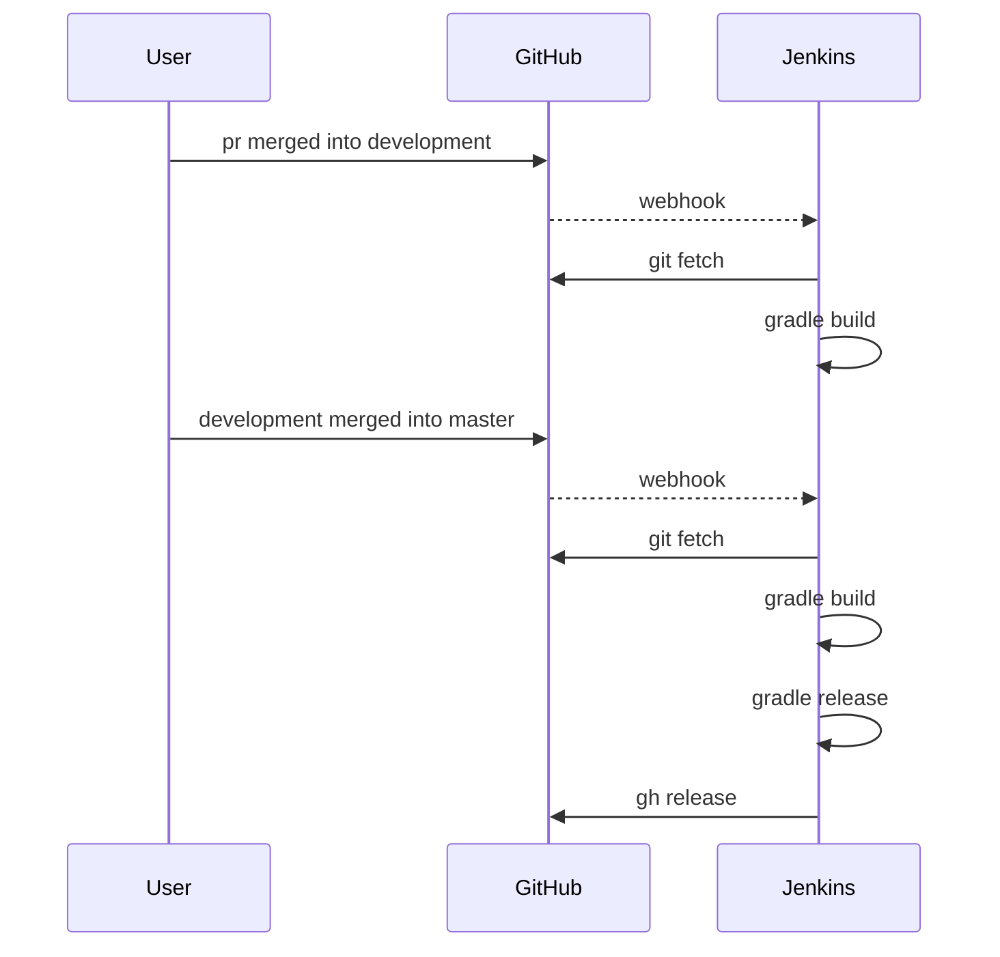

# CI/CD 文档

[toc]

## 简介

此文档记录了迭代二开发中 CI/CD（持续集成/持续部署）相关信息。

## 部署方案

版本控制平台采用 GitHub，CICD 工具采用 Jenkins，更新方式为 GitHub 通过 Webhook 通知 Jenkins.

*⬆️ 基本流程图* (Mermaid 绘制)

### 常设分支

版本控制平台上常维护有三条分支：

1. **`development` 分支**

   开发时的主要分支，所有新需求开发都应基于此分支创建新分支，完成开发后再发起 pull request 合并。

2. **`test` 分支（目前未启用）**

   测试分支，在 development 分支完成开发后，先合并进 test 分支进行测试部署。

3. **`master` 分支**

   发布分支，在 `test` 分支完成测试后合入此分支。

### 分支操作

Jenkins 会针对不同分支的更新，自动完成不同的 pipeline stage：

| 分支          | build | test | test-deploy | release | prod-deploy |
| ------------- | ----- | ---- | ----------- | ------- | ----------- |
| `development` | ✅     | ✅    |             |         |             |
| `test`        | ✅     | ✅    | ✅           |         |             |
| `master`      | ✅     | ✅    |             | ✅       | ✅           |

其中包含以下 stages：

- `build`: 执行 `gradle build`，构建项目并生成 fat jar.
- `test`: 执行 JUnit 测试。
- `test-deploy`: 将生成的 jar 部署到**测试环境**服务器。
- `release`: 执行 `gradle release`，向 `gradle.properties` 中指定的版本号创建一次 release，附带生成的 jar.
- `prod-deploy`: 将生成的 jar 部署到**生产环境**服务器。

> 🤯 TODO: 目前（2023/03/25）已经完成的 Jenkins pipeline stages 仅包括 `build` 和 `release`，后续将结合实际项目需求和服务器资源，完成其他 stages.
>

## 成果预览

### Jenkins 账号

- 地址：http://124.223.97.89:8080/
- 账号：supervisor
- 密码：nju19020520

### 截图

