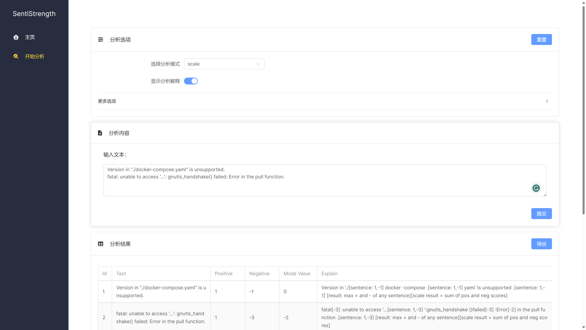

# 前端文档

| 变更人 | 变更日期   | 变更内容   |
| ------ | ---------- | ---------- |
| 邓尤亮 | 2023/04/08 | 文档初始化 |

[toc]

## 1. 项目简介

网页：http://124.223.97.89/

该项目采用了 Vue3 + Vite 技术，集成了 Vue-Router, Element-Plus, Font Awesome 等模块。

## 2. 界面设计

前端界面由左侧的导航栏和右侧的内容部分组成。

页面主要有主页和分析两个板块。在主页部分，我们简单介绍了 SentiStrength 这个项目；在分析部分，界面分为三块：分析选项、分析内容和分析结果。

## 3. 功能设计

在分析部分，用户首先配置分析的选项参数，包括分析模式、是否开启解释等选项，然后在文本框内填入待分析的文本（支持多行文本）。点击提交之后，便可以在分析结果的表格中查看分析结果。此外结果部分还支持导出成 CSV 文件的功能，便于用户保存分析结果。
