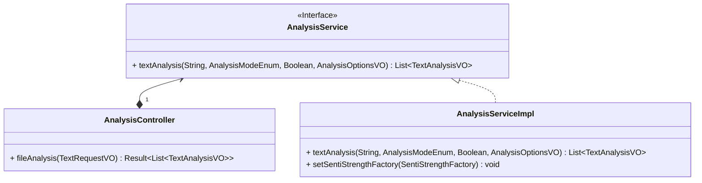

# 后端文档

| 变更人 | 变更日期   | 变更内容   |
| ------ | ---------- | ---------- |
| 谭子悦 | 2023/04/17 | 文档初始化 |

[TOC]

## Overview

在 SentiStrength 的后端设计上，我们遵循了“非侵入式”的设计思想，即让后端服务框架单向依赖 SentiStrength 核心库（下称 Core）。

以下将从技术栈、层次设计、运行方法等方面介绍。

## 技术栈

- Java 版本：17
- 框架：Spring Boot 3.0.5
- 存储：由于 SentiStrength 使用上并不需要持久化存储，所以没有选用数据库
- 架构：单体服务端系统
- 构建：Gradle + Jenkins + Docker

## 层次设计

由于没有持久化层，后端分为 Controller 和 Service 两层。

因为 SentiStrength 操作逻辑比较简单，所以两层各只设计了一个类，大体结构如下：



### Controller

Controller 采用 RESTful 设计。我们将返回值封装成 `Result<?>` 结构题返回，结构体中包含了返回码、返回信息和返回数据本体，便于让前端判断请求是否成功与后续拓展更多的异常类型。返回码和返回信息目前作为常量存储在 `ReturnCode` 类中。

### Service

Service 的主要实现逻辑是：

1. 将传入的请求 VO 转换成 Core 可读入的参数格式；
2. 创建/取出请求对应的 Core 实例；
3. 调用 Core 的单行执行方法，获取返回结果；
4. 将结果转换为对应结果 VO，并返回给 Controller.

其中在创建 Core 实例上，我们使用了抽象工厂模式进行设计，详情见 [项目重构设计文档](./项目重构设计文档.md)。

## 运行方法

在加入后端框架后，我们将 SentiStrength 的 main class 统一到了 `SentiStrengthApplication` 类。

在执行时可以根据参数运行 Core 本体或启动后端服务，其中只有在第一参数为 `--web` 的情况下才会启动后端服务，具体用法如下：

```bash
Usage: ~ --web <Path to SentiStrength_Data>
# 比如：
> java -jar sentistrength.jar --web ./SentiStrength_Data
```
