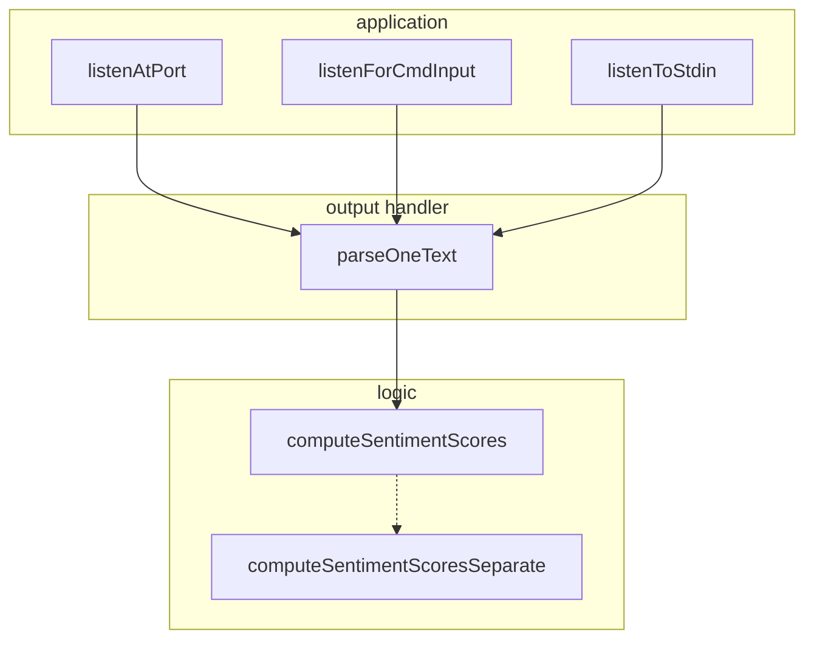
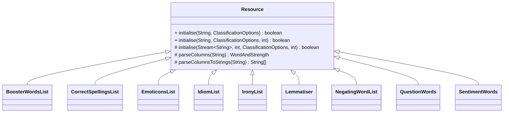
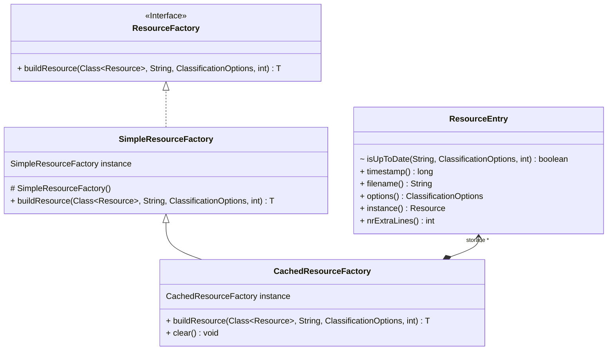

# 项目重构设计文档

| 变更人 | 变更日期   | 变更内容   |
| ------ | ---------- | ---------- |
| 谭子悦 | 2023/04/03 | 文档初始化 |
| 谭子悦 | 2023/04/16 | 完善文档   |

[TOC]

## 简介

SentiStrength 项目的重构设计文档。

本文档主要描述了在迭代二中进行的重构工作，每个重构部分包含对问题背景、重构方案、效果、进一步优化方向等的描述。

## 参数获取

### 问题

在原代码中，`SentiStrength` 中的参数获取的实现采用了简单粗暴的 "if 山"，如下：

```java

    // 参数识别
    // TODO: if 山也太慢了，能不能改成表驱动？
    for (i = 0; i < args.length; ++i) {
      try {
        if (args[i].equalsIgnoreCase("input")) {
          sInputFile = args[i + 1];
          bArgumentRecognised[i] = true;
          bArgumentRecognised[i + 1] = true;
        }
        if (args[i].equalsIgnoreCase("inputfolder")) {
          sInputFolder = args[i + 1];
          bArgumentRecognised[i] = true;
          bArgumentRecognised[i + 1] = true;
        }
				/* 此处省略若干 */
        if (args[i].equalsIgnoreCase("help")) {
          this.printCommandLineOptions();
          return;
        }
      } catch (NumberFormatException var32) {
        System.out.println("Error in argument for " + args[i] + ". Integer expected!");
        return;
      } catch (Exception var33) {
        System.out.println("Error in argument for " + args[i] + ". Argument missing?");
        return;
      }
    }
```

这样的实现有很大问题：

- 所有的判断都是 `if`，连 `else`，不考虑编译优化的话执行起来速度非常慢。
- 有大量诸如 `bArgumentRecognised[i] = true;` 的重复代码。
- 不便于阅读，也不便于修改与扩展。

### 重构方案

由上可见源码的问题主要在于：

1. 条件判断效率过低
2. 重复代码过多

所以基本解决思路为参照 Python 的 `argparse` 设计参数解析工具类 `ArgParser`，将参数解析的重复步骤抽象到该工具类中，这样原来的方法中就只需要负责添加参数和获取参数值。

例子：

```java
    ArgParser parser = new ArgParser(bArgumentRecognised);

    // 只包含一个后续参数
    String[] oneArgs = new String[]{...};
    for (String arg : oneArgs) {
      parser.addArgument(arg, 1, ArgParser.BOY_NEXT_DOOR);
      /**
       * 此处的第三个参数为对每个参数需要进行的取值映射操作，在类中预先定义了三种操作：
       * - SET_TRUE：出现该参数则取值为 true
       * - BOY_NEXT_DOOR：取该参数下一个参数内容为 String 值
       * - INT_NEXT_DOOR：取该参数下一个参数内容解析为 Integer 值
      */
    }

    // 不包含后续参数，仅设置为 true
    String[] boolArgs = new String[]{...};
    for (String arg : boolArgs) {
      parser.addArgument(arg, 0, ArgParser.SET_TRUE);
    }

    // 将后续参数转换为 int 类型的
    String[] intArgs = new String[]{...};
    for (String arg : intArgs) {
      parser.addArgument(arg, 1, ArgParser.INT_NEXT_DOOR);
    }

    // 解析参数
    Map<String, ArgParser.Value> valueMap = parser.parseArgs(args);

    // 对于 Help，直接打印并返回
    if (valueMap.containsKey("help")) {
      this.printCommandLineOptions();
      return;
    }

		// 封装的取值方法，如果不含该值就取原值
    sInputFile = ArgParser.extract("input", sInputFile, valueMap);
    /* ... */
    bWait = ArgParser.extract("wait", bWait, valueMap);

    if (bDoAll || bUseTotalDifference
        || valueMap.containsKey("iterations")
        || valueMap.containsKey("minimprovement")
        || valueMap.containsKey("multi")) {
      bTrain = true;
    }
```

### 效果

这样重构后代码逻辑变得清晰直观了很多，每一处参数获取都遵循 “添加参数 -> 解析参数 -> 获取参数值” 的三段步骤。

### 改进方向

由于 Java 不可以传递栈变量的指针，在实现 `Argparse` 时只能先把参数值保存到其内部 `Map` 中，再从 `Map` 里把值取回本地变量。虽然 Python 的 `Argparse` 也是这么干的（他用了一个 namespace object，等价于 `map`），但效率上肯定还是没有在 `Argparse` 中直接解析指针赋值快。关于这一点后续可以考虑继续优化。

## SentiStrength 交互接口

### 问题

在 `SentiStrength` 类中，STDIN 中的处理逻辑采用了这样的设计：

```java
private void listenForCmdInput(Corpus c) {
    BufferedReader stdin = new BufferedReader(new InputStreamReader(System.in));

    while (true) {
      while (true) {
        try {
          while (true) {
            String sTextToParse = stdin.readLine();
			/* .... */
          }
        } catch (IOException var13) {
          log.fatal(var13);
        }
	  }
    }
}
```

这里有三层循环，并不是好的代码设计；且最内层循环里的处理逻辑其实与普通单行文本处理是雷同的。

### 重构方案

我们在重构这部分的同时又发现 SentiStrength 其他的交互接口也存在着大量的重复逻辑和冗余代码，所以就一起做了方法抽象。

重构中采用了分层设计的思想，大致逻辑如下：



- 最高层负责对应独特功能的处理，比如 `listenAtPort` 建立 ServerSocket，`listenForCmdInput` 读取 stdin.
- 中间层接受上层请求后交给下层逻辑层处理，再讲返回结果输出到 stdout 中。
- 逻辑层同时也是 public 接口，负责单句执行 SentiStrength，并返回家过字符串 / 结构体给调用者。

此外，还做了别的变更：

- 原代码中，`listenAtPort` 接收 HTTP 请求，但返回却不走 HTTP 格式，导致这一接口根本不适合正常人类使用，所以我们对它进行了重构。
- 接口分离：
  - `computeSentimentScores` 返回结果字符串
  - `computeSentimentScoresSeparate` 返回结果结构题

### 效果

大幅度减少了 `SentiStrength` 类中的冗余代码，让整体的逻辑变得更加清晰了。

同时分离出接口 `computeSentimentScores` 和 `computeSentimentScoresSeparate` 也便于后端代理类读取执行结果：可以直接从结构体中获取，而非解析字符串。

### 改进方向

这里几个接口的功能其实对于目前的使用场景来说是没用的，在后续迭代中可以视情况删除。

## ClassificationResources 资源抽象

### 问题

`ClassificationResources` 类负责在初始化时创建 SentiStrength 所需要的所有资源对象。在原代码的实现中，该类的初始化逻辑基本就是单调的改名重复代码：

```java
/* 上面还有一个资源类 */
if (emoticons.initialise(Path.of(sgSentiStrengthFolder, sgEmoticonLookupTable).toString(), options)
        && correctSpellings.initialise(Path.of(sgSentiStrengthFolder, sgCorrectSpellingFileName).toString(), options)
        /* 省略五行 */
        && idiomList.initialise(Path.of(sgSentiStrengthFolder, sgIdiomLookupTableFile).toString(), options, iExtraLinesToReserve)) {
  if (iExtraLinesToReserve > 0) {
    return evaluativeTerms.initialise(Path.of(sgSentiStrengthFolder, sgAdditionalFile).toString(), options, idiomList, sentimentWords);
  } else {
    return true;
}}
```

可见这 9 个资源类的创建方法基本全是一样的，而原代码中的写法既不便于阅读，也不便于维护。

我们又深入去看了这 9 个资源类初始化方法中的具体逻辑，发现连他们的具体逻辑都是大致一样的，也就是原代码在这九个类的初始化中基本全是暴力复制粘贴。

### 重构方案

#### 抽象资源类

考虑到资源类初始化逻辑基本完全一致，我们新设计了一个抽象类 `Resource` 作为它们的 superclass，大致组成如下：



`Resource` 中的 `initialise(String, ClassificationOptions, int) boolean` 抽象了资源初始化时的通用逻辑（检查源文件是否存在、是否可用、打开文件流等操作），
各 subclass 只需覆写抽象方法 `initialise(Stream<String>, int, ClassificationOptions, int) boolean` 来进行各自资源内部的初始化。

除此之外，还在 `Resource` 中编写了 `parseColumns(String)` 等 helper 方法，简化 subclasses 的处理逻辑。

#### 资源工厂类

就算基于 `Resource` 类，`ClassificationResources` 初始化时还是需要显式地先创建资源对象再对资源调用初始化方法，这样虽然使用上没有问题，但假如资源的初始化方法发生了改变，那么我们也要随之修改
大量的创建代码。为了隔离这一变化，我们又进一步设计了资源的工厂类，组成如下：



其中 `ResourceFactory` 为工厂接口，`SimpleResourceFactory` 是最简单的工厂实现。

`build` 方法接收一个 `Class` 对象和两个初始化选项作为参数，内部创建会根据 `Class` 创建对应的资源。

在我们当前的后端设计中，每个请求都会创建一个新的 SentiStrength 对象，而这同时也就以为着每个请求都要重新构建所有初始化对象。
然而实际使用场景下，资源的源文件通常都是固定不变的，因此这带来了额外的开销。

为了解决这个问题，我们又设计了 `CachedResourceFactory` 实现来缓存已经初始化过的资源对象，于是对已经初始化的资源对象，如果它还未“过期”，则直接返回；否则再创建新对象。
同时工厂本身采用 Singleton Pattern 加以并发控制，这样一来不同 SentiStrength 实例就可以共享相同的资源，同时具备了 Flyweight Pattern 的性质。

> 判断 out of date 的逻辑详见代码

#### Put them together

TODO：

### 效果

采用 `CachedResourceFactory` 后同资源多次创建的性能平均提升约 80%，而单次创建的性能与原来持平。

测试统计数据（在测试 `uk.ac.wlv.sentistrength.factory.CachedFactoryTest#perfTest` 中）: 

```java
== Scene 1: Processing 32 requests concurrently
> Simple: 145 ms
> Cached: 22 ms
> Cached / Simple = 0.15

== Scene 2: Run exactly once
> Simple: 112 ms
> Cached: 111 ms
> Cached / Simple = 0.99
```